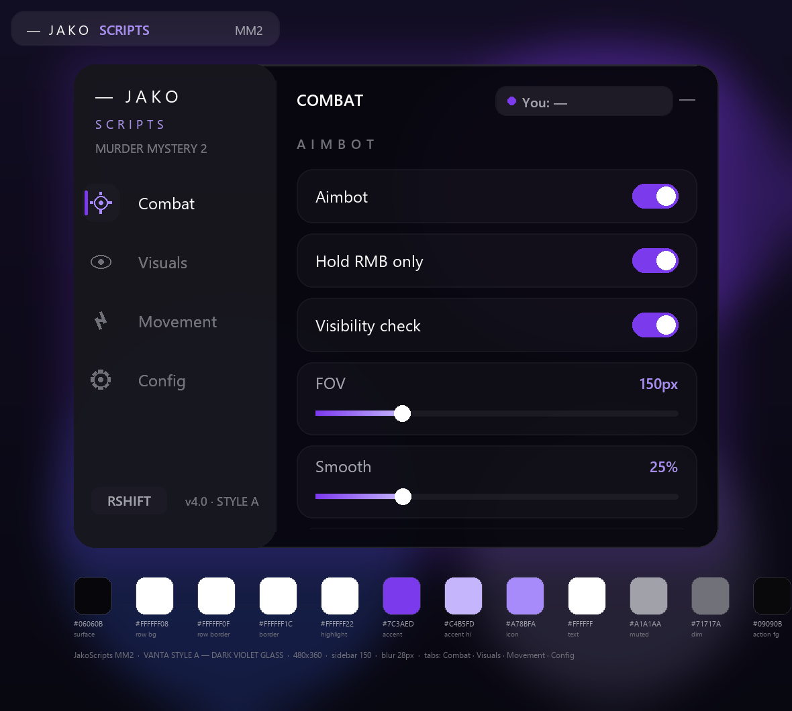

# JakoScripts

Скрипты для Roblox. Оформление — VANTA Style A «Dark Violet Glass».

```
окно 480x360 · сайдбар 150 · Combat / Visuals / Movement / Config · RightShift
```

## Скрипты

Каждая игра лежит в своём гисте и отдаёт два файла: обычный и light-obf сборку. Обе ссылки живые, разница только в читаемости кода.

| Игра | Обычная ссылка | Обф-ссылка | Вкладки |
|---|---|---|---|
| Murder Mystery 2 | [vanta_mm2.lua](https://gist.githubusercontent.com/JakoScripts/d9426b0772256a4709608e96f710508d/raw/vanta_mm2.lua) | [vanta_mm2_obf.lua](https://gist.githubusercontent.com/JakoScripts/d9426b0772256a4709608e96f710508d/raw/vanta_mm2_obf.lua) | Combat · Visuals · Movement · Config |
| Murder Mystery 2 — standalone | [vanta_mm2_standalone.lua](https://gist.githubusercontent.com/JakoScripts/2ad75acf1f3a734418594bb44d42f09e/raw/vanta_mm2_standalone.lua) | [vanta_mm2_standalone_obf.lua](https://gist.githubusercontent.com/JakoScripts/2ad75acf1f3a734418594bb44d42f09e/raw/vanta_mm2_standalone_obf.lua) | Combat · Visuals · Movement · Config |
| The Lost Front | [vanta_lostfront.lua](https://gist.githubusercontent.com/JakoScripts/de7c068ca91e534ed54f3e64d191483f/raw/vanta_lostfront.lua) | [vanta_lostfront_obf.lua](https://gist.githubusercontent.com/JakoScripts/de7c068ca91e534ed54f3e64d191483f/raw/vanta_lostfront_obf.lua) | Combat · Visuals · Movement · Config |
| Steal an Egg | [vanta_stealegg.lua](https://gist.githubusercontent.com/JakoScripts/5f6e4bcab0f3df2680a1944a29362b1a/raw/vanta_stealegg.lua) | [vanta_stealegg_obf.lua](https://gist.githubusercontent.com/JakoScripts/5f6e4bcab0f3df2680a1944a29362b1a/raw/vanta_stealegg_obf.lua) | Farm · Visuals · Stealth · Config |
| Blade Ball | [vanta_bladeball.lua](https://gist.githubusercontent.com/JakoScripts/0ce0c7ccfe1655547e19253ab16138b2/raw/vanta_bladeball.lua) | [vanta_bladeball_obf.lua](https://gist.githubusercontent.com/JakoScripts/0ce0c7ccfe1655547e19253ab16138b2/raw/vanta_bladeball_obf.lua) | Combat · Timing · Visuals · Config |
| Deagle Duels | [vanta_deagle_duels.lua](https://gist.githubusercontent.com/JakoScripts/f037386d8aac2c924d78bee6157c3f66/raw/vanta_deagle_duels.lua) | [vanta_deagle_duels_obf.lua](https://gist.githubusercontent.com/JakoScripts/f037386d8aac2c924d78bee6157c3f66/raw/vanta_deagle_duels_obf.lua) | Combat · Visuals · Misc · Config |
| FPV Drone Game | [vanta_fpv_esp.lua](https://gist.githubusercontent.com/JakoScripts/61316c34897c57a840d0e1bdd24724ef/raw/vanta_fpv_esp.lua) | [vanta_fpv_esp_obf.lua](https://gist.githubusercontent.com/JakoScripts/61316c34897c57a840d0e1bdd24724ef/raw/vanta_fpv_esp_obf.lua) | Visuals · Drones · Config |
| generic FPS | [vanta_hitbox.lua](https://gist.githubusercontent.com/JakoScripts/61e8e91041a490a3e8f258cfbbcc51c7/raw/vanta_hitbox.lua) | [vanta_hitbox_obf.lua](https://gist.githubusercontent.com/JakoScripts/61e8e91041a490a3e8f258cfbbcc51c7/raw/vanta_hitbox_obf.lua) | Combat · Targets · Config |
| generic shooter | [vanta_wh.lua](https://gist.githubusercontent.com/JakoScripts/455138e3d75b17f9610507f66b7594aa/raw/vanta_wh.lua) | [vanta_wh_obf.lua](https://gist.githubusercontent.com/JakoScripts/455138e3d75b17f9610507f66b7594aa/raw/vanta_wh_obf.lua) | Visuals · Targets · Config |

Запуск — одной строкой:

```lua
loadstring(game:HttpGet("<ссылка из таблицы>"))()
```

Локально, если файл лежит в workspace экзекутора:

```lua
loadstring(readfile("JakoScripts_wh.lua"))()
```

## Обновление

Репозиторий — источник. Правки идут в `main`, клиент тянет свежую версию при запуске: строку в инжекторе менять не нужно.

```lua
loadstring(game:HttpGet("https://raw.githubusercontent.com/JakoScripts/JakoScripts/main/JakoScripts_wh.lua"))()
```

Репозиторий приватный, поэтому raw без токена отдаёт 404 — либо публичный доступ, либо `JakoScripts_bootstrap.lua` с fine-grained PAT (Contents: Read-only) в `CFG.token`.

## Интерфейс

| Токен | Значение |
|---|---|
| surface | `#06060B` |
| glass | белый 6–10% + blur 28px |
| border / highlight | `#FFFFFF1C` / `#FFFFFF22` |
| accent | `#7C3AED` |
| icon | `#A78BFA` |
| text | `#FFFFFF` / `#A1A1AA` / `#71717A` |
| action | `#FFFFFF` на `#09090B` |
| row | `#FFFFFF08` / бордер `#FFFFFF0F` / радиус 12 |
| switch | ON `#7C3AED`, OFF `#FFFFFF1E` |
| slider | трек `#FFFFFF15`, заливка `#7C3AED → #C4B5FD` |

Шрифт Inter с откатом на Gotham. Иконки — lucide `target / eye / zap / settings`, нарисованы вектором. Эмодзи в интерфейсе нет. Клавиша скрытия окна — RightShift, переназначается в Config.



Превью на каждый скрипт: `JakoScripts_<имя>_preview.png`.

## Файлы

| Файл | Что это |
|---|---|
| `StyleA_shell.lua` | шелл Style A, вшивается в каждый скрипт байт-в-байт |
| `JakoScripts_<игра>.lua` | скрипты |
| `JakoScripts_bootstrap.lua` | вход для приватного репо (токен) |
| `JakoScripts_loader.lua` | лоадер с миррорами и локальным фолбэком |
| `JakoScripts_silencer.lua` | глушит нативные тосты Roblox (`SetCore SendNotification`) |
| `light_obf.py` | сборка light obf: локальные в `_XX<n>`, строки в hex, комментарии срезаны |
| `obf_diff.py` | сверка токен-потоков обычного файла и обф-сборки |
| `inject_shell.py` | вставка/обновление шелла по маркеру `-- @@SHELL@@` |
| `ship_gists.py` | залив обычного и обф-файла в гист, с воротами проверки |
| `JakoScripts_check.py` | структурная проверка Luau: блоки, вызовы, шелл-API, связка State ↔ UI |
| `JakoScripts_preview.py` | рендер мокапа: читает вкладки прямо из кода |
| `verify_refactor.py` | диф логики между исходником и рефактором |

## Как устроена сборка

Каждый скрипт собран одной заменой: старый UI-блок вырезан до маркера `-- @@SHELL@@`, игровая логика не тронута. Шелл подставляется скриптом, поэтому во всех восьми файлах он идентичен — правка дизайна не требует ручной синхронизации.

```powershell
python inject_shell.py                    # обновить шелл во всех скриптах
python inject_shell.py JakoScripts_wh.lua # или в одном
python JakoScripts_check.py *.lua         # структурная проверка
python JakoScripts_preview.py --all       # перерендерить превью
python ship_gists.py --check              # сравнить гисты с локальными файлами
python ship_gists.py                      # залить обычный + обф
```

Обф-сборка не выпускается, если ломает код: `ship_gists.py` прогоняет её через `obf_diff.py` (токен-поток обязан совпасть с обычным файлом, переименование — быть согласованным) и через структурную проверку (не должно появиться новых неопределённых имён или потерянных объявлений). Не прошло — файл не публикуется.
